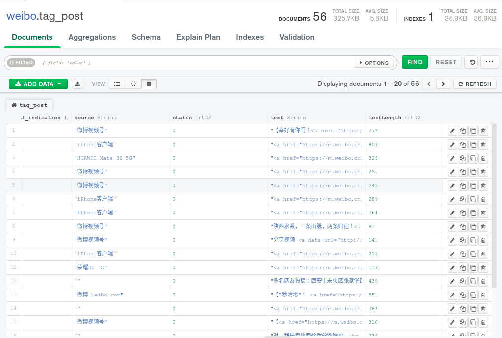
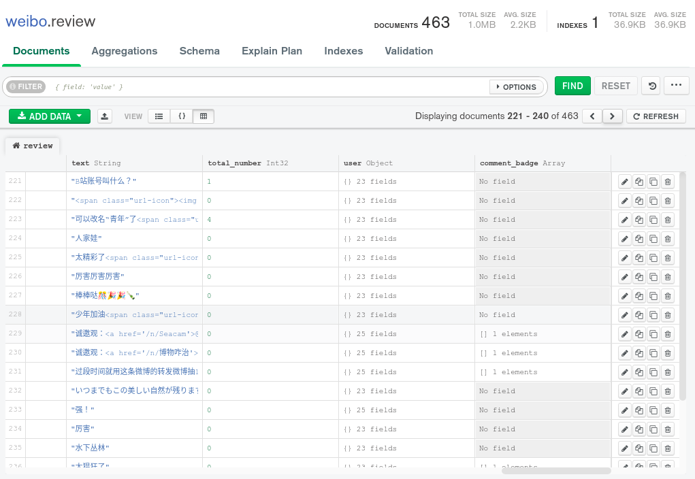

# Spider

   

A spider for news on facebook, twitter, weibo and wechat.

## Preview

#### 1. Weibo

##### 1.1 Some difficulties of scraping on weibo

- I have to scan QR code to login, but does it work when i log in by urllib? 
- Weibo PC version has the most strict anti-spider protection. Developers need a lot of experience to bypass the anti-spider protection.
> Anti-spider measures:
>  - Detection of abnormal IP traffic.
>  - Protectionof user data.
>  - Account login abnorality detection.
>  - Kinds of verification code.
>
> Previous solutions:
>  - Account pool
>  - By studying the certification mechanism of Weibo to achieve automated simulated login. For example, we may need to access to the QR code platform or artificial identification to bypass the QR code authorization.  
>  - Simulate a login process of normal users: get corresponding cookies to build a "cookie pool", and use these cookies to processing the scraping.  
>  - Purchasing a certain number of IP and bind the agent IP for each cookie.
>  - Attention to the load balancing of each cookie-Ip and to clean the cache after the cookie expires.
>
> Above all, the scarping processing on PC website of Weibo is so thorny and inefficient, it also contains high errors and is difficult to ensure that the complete user data can be obtained in large-scale data acquisitions. 

##### 1.2 **Possible solutions**:

- Use the mobile site of Weibo: [M weibo](m.weibo.cn), which provides the data source for users on mobile phone. This website has much loose anti-spider protections. With this website, we don't need to build cookie pool and agent IP (of course, there's a lot of restrictions of acquisition speed). But anyway this is a lightweight and efficient weibo spider.
- Use json file to save the data, since the acquired data from [M weibo](m.weibo.cn) is in  json format, there's basically little need for data cleaning, which increases the scraping speed much. At the same time, the JSON data obtained through the dat interface is extremely rich - about 10 posts through 1 request. 

## overall idea

todo

## How to start

### Operating environment

- Operating system: Common Linux distribution is feasible (my OS for development test is ubuntu 20.04) 
- `Python> = 3.6.0`
- `mongoDB> =4.2`
-  Docker, if you can, please keep the Docker version is the latest

###  Initialize

Clone and install the dependencies of python

```shell
git@github.com:LonelVino/Spider.git
cd Spider
pip install -r requirements.txt
```

**Initialize docker container:** 
The container is mounted from image `mongoDB`, used as a database of spider. 

```shell
sudo chmod 755 ./init/init.sh
./init/init.sh
```

`Init.sh` will create the necessary configurations and mapped directories for `mongoDB` in the docker container.  The data is stored in `Home/mongo`

**Initialize the database:**

Then，according to the hint of`init.sh`，we need to execute the following command to call the script `db_init.js`，which is used to initialize the database.

It will create 2 users respectively: `admin`(administrator) and `weibo`(usual user)，and 4 tables `weibo`,`post, user` and `error_log`.

> **NB**:  You will be asked to input your own password when you create the `admin` and `weibo`.

```shell
sudo docker exec -it weibo mongo 127.0.0.1:27018 /etc/resource/db_init.js
```

**Modify the params:**

At last，rewrite `./WeiboSpider/database/DBconnector.py`，modify the `mongo_pwd` in function `__init__` to your own password，which is used for Spider to connect to the database。

```python
def __init__(self):
  self.mongo_uri = "127.0.0.1:27018" # IP used to connect with Docker.
  self.mongo_database = "weibo" # database created from init_db.js
  self.mongo_user_name = "weibo" # the user in database 'weibo'
  self.mongo_pass_wd = "Your password."
```

> ##### Some tips of Docker
>
> start or stop a docker container
>
> ```shell
> sudo docker container start [container name]
> sudo docker container stop [container name]
> sudo docker container ls
> ```
>
> Check the ip of container
>
> ```shell
> docker inspect -f '{{range.NetworkSettings.Networks}}{{.IPAddress}}{{end}}' [container_id or container_name]
> ```
>

### Start

#### With terminal command

There are 3 spiders available now, and the corresponding commands are as follow:

|  Spider Name   |                    CMD                     |                           Function                           |
| :------------: | :----------------------------------------: | :----------------------------------------------------------: |
| `wb_spider` | `scrapy crawl wb_spider -a uid=xxx&verbarxxx` | Collecting the target users’ information and all blog posts, which must be introduced `-a uid = xxx &verbar xxx"` (the target collection user's `UID`) |
| `user_spider`  | `scrapy crawl user_spdier -a uid=xxx&verbarxxx`  | Collect the target users’ information， parameters are the same as`weibo_spider`. |
| `user_post_spider`  | `scrapy crawl user_post_spider -a uid=xxx&verbarxxx`  | Collect all the blog posts of the target users, parameters are the same as`wb_spider`. |
| `tag_post_spider`  | `scrapy crawl tag_post_spider -a uid=xxx&verbarxxx`  | Collect all the blog posts of the target hashtag and reviews of each post, parameters `uid` should be `%23[keyword]`, such as `%23陕西` (the whole command is `scrapy crawl tag_post_spider -a uid="%23陕西"`). |

#### With Python Script

According to the [command line tool of scrapy](https://doc.scrapy.org/en/latest/topics/commands.html?highlight=scrapy%20crawl), we can execute `cmd` command with python to call the sprider:

```python
from scrapy.cmdline import execute

if __name__ == '__main__':
    spider_cmd = "scrapy crawl wb_spider -a uid=user1_id|user2_id|...."
    execute(spider_cmd.split())
    
```

### DataBase

You have kinds of ways to explore the database, such as [MongoDB Atlas](https://docs.atlas.mongodb.com/getting-started/), [MongoDB Compass](https://docs.mongodb.com/compass/current/), [MongoDB Server](https://docs.mongodb.com/manual/tutorial/getting-started/), etc., according to the [MongoDB documents](https://docs.mongodb.com/). Here, I used MongoDB Server and MongoDB Compass together.

#### MongoDB Server

You can refer to the [official tutorial](https://docs.mongodb.com/manual/tutorial/getting-started/), which is very comprehensive.

#### MongoDB Compass
Besides, I use [MongoDB Campass](https://docs.mongodb.com/compass/current/) to visualize the database, which is a powerful GUI for querying, aggregating, and analyzing the MongoDB data in a visual environment. The examples of Database are as follows:




## Structure

```
📦wb_spider
 ┣ 📂base
 ┃ ┣ 📜BaseConfig.py
 ┃ ┣ 📜BaseSpider.py
 ┃ ┣ 📜Pipeline.py
 ┃ ┗ 📜__init__.py
 ┣ 📂config
 ┃ ┣ 📜ReviewConfig.py
 ┃ ┣ 📜TagPostConfig.py
 ┃ ┣ 📜UserConfig.py
 ┃ ┣ 📜UserPostConfig.py
 ┃ ┗ 📜__init__.py
 ┣ 📂database
 ┃ ┣ 📜DBConnector.py
 ┃ ┗ 📜__init__.py
 ┣ 📂items
 ┃ ┣ 📜ErrorItem.py
 ┃ ┣ 📜LongtextItem.py
 ┃ ┣ 📜ReviewItem.py
 ┃ ┣ 📜TagPostItem.py
 ┃ ┣ 📜UserItem.py
 ┃ ┣ 📜UserPostItem.py
 ┃ ┗ 📜__init__.py
 ┣ 📂middlewares
 ┃ ┣ 📜DepthMiddleware.py
 ┃ ┣ 📜FakeUserAgentMiddleware.py
 ┃ ┣ 📜InitialMiddleware.py
 ┃ ┣ 📜ProxyMiddleware.py
 ┃ ┣ 📜RetryMiddleware.py
 ┃ ┗ 📜__init__.py
 ┣ 📂pipelines
 ┃ ┣ 📜ErrorPipeline.py
 ┃ ┣ 📜LongtextPipeline.py
 ┃ ┣ 📜ReviewPipeline.py
 ┃ ┣ 📜TagPostPipeline.py
 ┃ ┣ 📜UserPipeline.py
 ┃ ┣ 📜UserPostPipeline.py
 ┃ ┗ 📜__init__.py
 ┣ 📂resource
 ┃ ┗ 📜0.1.11.json
 ┣ 📂spiders
 ┃ ┣ 📂__pycache__
 ┃ ┃ ┣ 📜__init__.cpython-38.pyc
 ┃ ┃ ┗ 📜wb_spider.cpython-38.pyc
 ┃ ┣ 📂_spider
 ┃ ┃ ┣ 📜__init__.py
 ┃ ┃ ┣ 📜tag_post_spider.py
 ┃ ┃ ┣ 📜user_info_spider.py
 ┃ ┃ ┗ 📜user_post_spider.py
 ┃ ┣ 📜__init__.py
 ┃ ┗ 📜wb_spider.py
 ┣ 📜__init__.py
 ┗ 📜settings.py
```