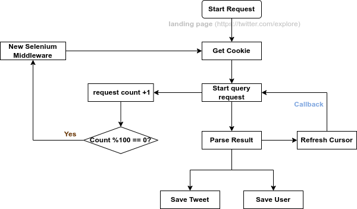

## Development Log

### 1. Weibo

#### 1.1 Some difficulties of scraping on Weibo

- I have to scan QR code to login, but does it work when i log in by urllib? 
- Weibo PC version has the most strict anti-spider protection. Developers need a lot of experience to bypass the anti-spider protection, how can I deal with these maddening shit?

> Anti-spider measures:
>  - Detection of abnormal IP traffic.
>  - Protectionof user data.
>  - Account login abnorality detection.
>  - Kinds of verification code.
>
> Previous solutions:
>  - Account pool
>  - By studying the certification mechanism of Weibo to achieve automated simulated login. For example, we may need to access to the QR code platform or artificial identification to bypass the QR code authorization.  
>  - Simulate a login process of normal users: get corresponding cookies to build a "cookie pool", and use these cookies to processing the scraping.  
>  - Purchasing a certain number of IP and bind the agent IP for each cookie.
>  - Attention to the load balancing of each cookie-Ip and to clean the cache after the cookie expires.
>
> Above all, the scarping processing on PC website of Weibo is so thorny and inefficient, it also contains high errors and is difficult to ensure that the complete user data can be obtained in large-scale data acquisitions. 

#### 1.2 **Possible solutions**:

- Use the mobile site of Weibo: [M weibo](m.weibo.cn), which provides the data source for users on mobile phone. This website has much loose anti-spider protections. With this website, we don't need to build cookie pool and agent IP (of course, there's a lot of restrictions of acquisition speed). But anyway this is a lightweight and efficient weibo spider.
- Use json file to save the data, since the acquired data from [M weibo](m.weibo.cn) is in  json format, there's basically little need for data cleaning, which increases the scraping speed much. At the same time, the JSON data obtained through the dat interface is extremely rich - about 10 posts through 1 request. 


### 2. Twitter

#### 2.1 Some difficulties of scraping on Twitter

Twitter also has anti-spider protections as Weibo, but to some extent, the data on Twitter is a little bit easier to scrape, for example, Twitter doesn't has a lot of verification codes and <u>Twitter provides available APIs for developers to explore the data:</u> [Twitter API for developers](https://dev.twitter.com/rest/public)

> Limitations of APIs: 
>- <=180 requests in 15 mins
>- <= 100 tweets per request
>- only accesss Tweets written in the **past 7 days**
>

#### 2.2 Overall idea of Twitter Spider

**(1) Important Tweet Data Field**

- Basic: `id`, `url`, `text`, `html`, `timestamp`, `epoch timestamp`;
- Related: `Links`, `Hashtags`, `Image URL`, `Video URL` inside Tweet;
- Statistics: number of `likes`, `replies`, `retweets`;
- User: `username`, `screen name`, `user_id`;
- reply: `reply to`, `replied to`, `users Tweet is an reply to`;

**(2) Additional User Data Field**
    
- Basic: `data joined`, `localtion`, `blog`, `is verified`
- Statistics: number of `tweets`, `following`, `followers`, `likes`, `lists`


**Twitter Spider Structure**



**Conversation of each Tweet**


```python
entries = data.threaded_conversation_with_injections.instructions.entries

for entry in entries:
    entry_id = entry['entryId']
	items = entry['content']['items']
	for item in items:
        result = item['itemContent']['tweet_results']['result']
        user_info = result['core']['user_results']['result']
        entry_info = result['legacy']   # text, created_time, etc.,
        # mentioned_user_info = entry_info['entities']['user_mentions'] 
```

```
entry 1
|-- item 1/itemContent/tweet_result/result  
	|-- core/user_results/result   # user_info
	|-- legacy     # entry_info
```

> NB: number of items: the number of conversations in one reply
